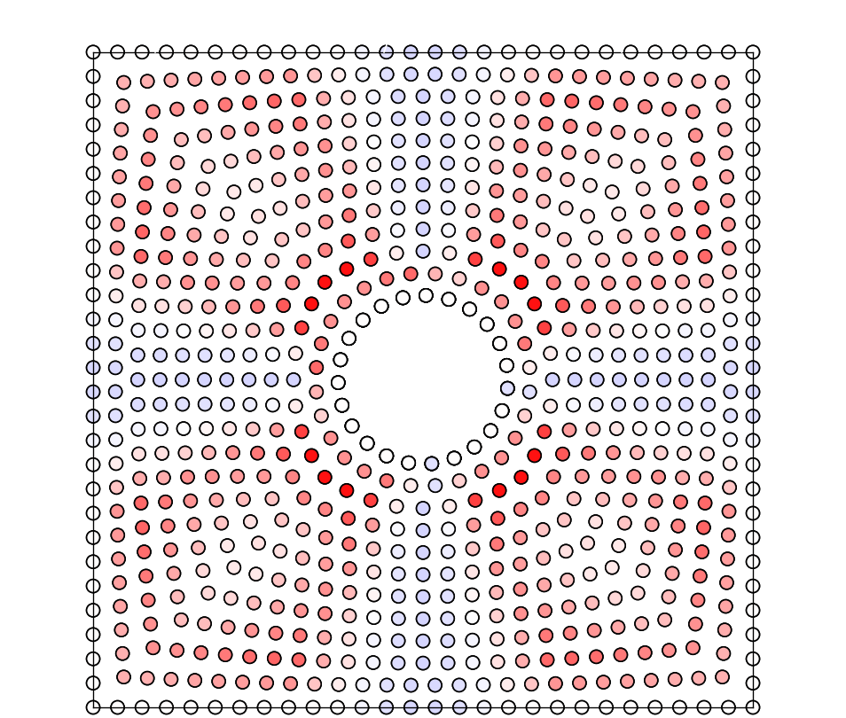

# Circle2Square

Interpolation between a circle and a square

```
python gen_mem.py 7
```

## Resampling of curves to keep even density

<p align="center">
  
</p>

## Constant number of points

<p align="center">
  
</p>

## Comparison

Here we compare the difference between both algorithms. In both cases we use a linear interpolation between both shapes. We first compare the difference between the default behaviour of both. A red-white-blue color map is used to show the shortest distance for a given sphere to any other sphere inlcuding periodic boundary conditions (PBC) this help to visualize the difference in the packing from the desired 1.875 value. The values range from 0.5 (red) and -0.5 (blue).


<p align="center">
  
  <em>Resampling</em>
  
  <em>No Resampling</em>
</p>

We also included the effect of the $\sigma$ parameter that allows to further modify the packing of the spheres for the resampling method. 

<p align="center">
  
  
  
  
  
  
</p>
